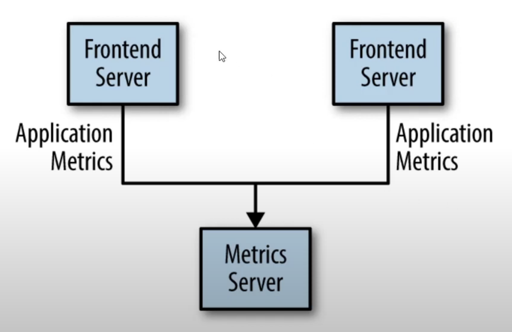
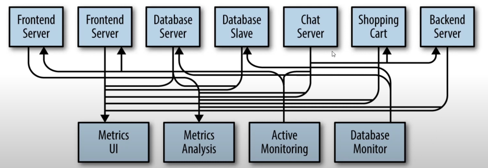
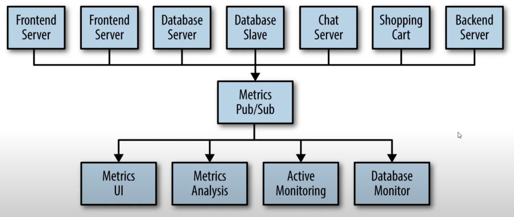
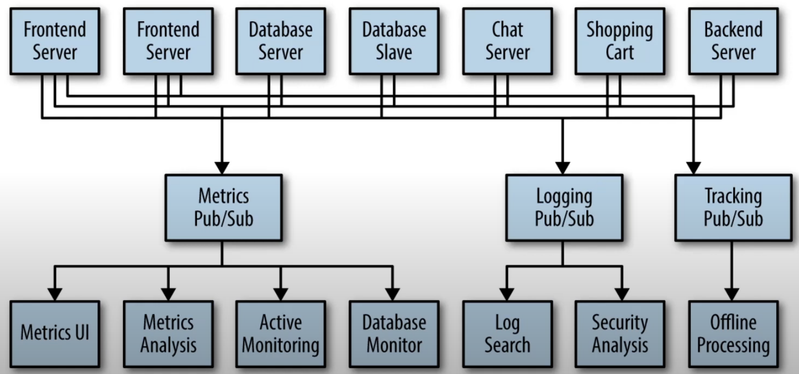
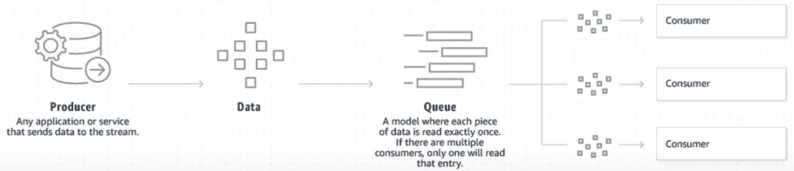

## 실시간 스트리밍 플랫폼

### Streaming이란

데이터가 들어올때마다 하나하나 처리를 하는것

배치 시스템도 실시간처럼 보이지만 초단위로 데이터를 모아서 처리하므로 네이티브 스프리밍이라고 볼수는 없다.

## 

### Apach Kafka

오픈소스 분산 이벤트 스트리밍 플랫폼

- Publish/Subscribe Messaging 기반
    - 다음과 같이 두대의 프론트 서버와 프론트에서 발생하는 지표를 수집하는 서버가 있다. 이때에는 두대의 프론트 서버에서 발생하는 이벤트들을 하나의 서버에서 받으면 된다.

      

    - 하지만 다른 지표들도 생겨 다음과 같이 데이터베이스 서버, 채팅 서버, 백엔드 서버 등등에서 받아오고 있다. 또한 이 데이터들을 보여주는 UI와 분석 도구, 모니터링이나 데이터 베이스 모니터등이 있을때 각각의 서버들을 “직접” 연결 하다보면 시스템이 매우 복잡해진다.

      

    - 그래서 중앙에 Pub/Sub 메시징 시스템을 만들게 된다. 각각의 서버(퍼블리셔)들이 발생하는 지표들을 던지면 구독하고 있는 분석, 모니터링 도구들이 받아가게 된다.

      

    - 더 나아가 꼭 지표 뿐만이 아닌 로깅과 트랙킹등 다른 이벤트처리 해야 할것도 생긴다. 이때 메시징 시스템을 각각 따로 다음과 같이 만들어야 할까?

      

    - 아니다. 다 통합한 시스템을 만들 수 있다. 그것이 카프카다.
- 카프카는 다음과 같은 두가지 모델을 합친것이다.
    - 데이터 큐 처리 모델 -  Pruoducer가 데이터를 던지면 그것을 큐에 넣어두고 여러개의 Consumer들중 각 Consumer가 한번씩만 읽어 처리하는것

      

    - Publish-Subscribe 모델 -  여러가지 이벤트들이 쏟아질때 그 이벤트들을 구독하는 Consumer가 여러개 일수도 하나일수도 있는 구조

### 따라서 카프카는 매우 빠르고, 무한으로 확장이 가능하며 전달되는 이벤트 스트림을 내부에 분산해서 안전하게 저장하며 고가용성이다. 여러 프로그램에서 접근이 가능하다.

### Kafka Use Cases

- 실시간 웹의 지표, 로그
- 메세징용
- 데이터가 변경되는 것을 스트림으로 받아옴

[맨위로👆](#){: .btn .btn--primary }

